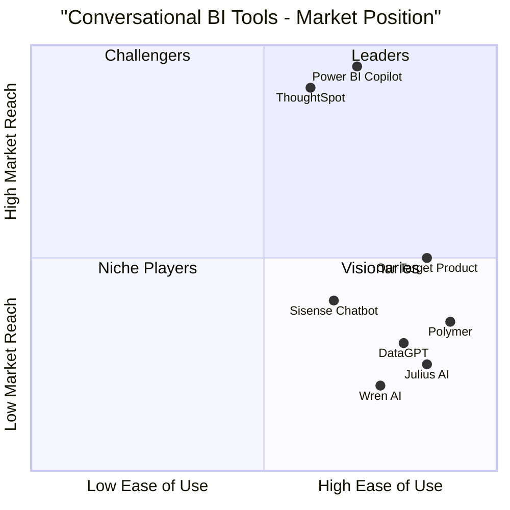
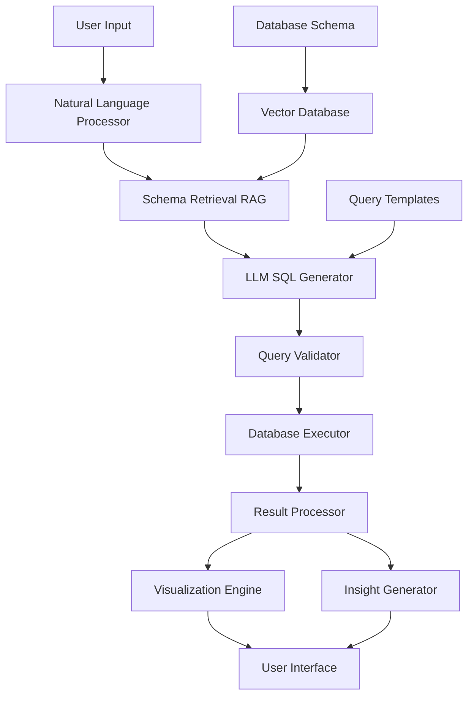

# LLM-Powered Data Analyst Assistant - Product Requirements Document

## 1. Project Information

**Language:** English  
**Programming Language:** Python, LangChain, FastAPI, Streamlit/Gradio, TypeScript (for frontend components)  
**Project Name:** llm_data_analyst_assistant  
**Original Requirements:** Build a chat-based data analyst — an AI assistant that understands natural language queries (like "Show me last month's top 5 performing products") and automatically converts them to SQL, runs the query, and returns insights + visualizations instantly. It transforms how startups and teams make decisions — replacing static dashboards with AI-driven conversations with data.

## 2. Product Definition

### 2.1 Product Goals

1. **Democratize Data Access**: Enable non-technical users to query databases using natural language, eliminating the need for SQL knowledge
2. **Accelerate Decision Making**: Reduce data query time from 15 minutes to under 30 seconds through automated SQL generation and execution
3. **Enhance Data Insights**: Provide automated visualization and natural language explanations of query results to improve data comprehension

### 2.2 User Stories

1. **As a startup founder**, I want to ask "What are our top 3 revenue sources this quarter?" and get instant charts and explanations, so that I can make quick strategic decisions without waiting for data team support.

2. **As a marketing manager**, I want to query "Show me conversion rates by traffic source last month" in plain English, so that I can optimize our marketing spend without learning SQL.

3. **As a product analyst**, I want to ask follow-up questions like "Why did revenue increase in Q2?" and get contextual insights, so that I can understand data trends conversationally.

4. **As a small business owner**, I want to upload my sales database and ask "Which products should I restock?" so that I can get actionable inventory recommendations instantly.

5. **As a data team member**, I want to provide a self-service analytics tool to business stakeholders, so that I can reduce routine query requests and focus on complex analysis.

### 2.3 Competitive Analysis

| Platform | Strengths | Weaknesses | Market Position |
|----------|-----------|------------|-----------------|
| **ThoughtSpot** | $150M+ ARR, acquired Mode for $200M, Search-driven analytics, NLQ/NLG | Enterprise-focused, high cost, complex setup | Market Leader |
| **Microsoft Power BI Copilot** | Widest adoption in enterprise, "Show Q2 sales trends" → instant visuals | Microsoft ecosystem dependency, limited customization | Enterprise Standard |
| **Sisense Analytics Chatbot** | GenAI-powered conversational analytics, React components, API-first embedding | Beta stage, limited market presence | Emerging Player |
| **DataGPT** | Conversational AI analyst, Natural language insights generation | Venture-backed startup, unproven scale | Startup Competitor |
| **Wren AI GenBI** | Self-service + chatbot + AI agent hybrid, Raw data exploration without dashboards | Cloud platform launch 2025, early stage | Future Competitor |
| **Julius AI** | Open source approach, freemium model | Limited enterprise features | Open Source Alternative |
| **Polymer** | User-friendly interface, quick setup | Limited advanced analytics | SMB Focused |

### 2.4 Competitive Quadrant Chart



## 3. Technical Specifications

### 3.1 Requirements Analysis

The LLM-Powered Data Analyst Assistant requires a sophisticated architecture that can handle natural language processing, SQL generation, database querying, and result visualization. Key technical challenges include:

- **Schema Awareness**: LLMs need complete database schema context to generate accurate SQL. Real-world databases have hundreds or thousands of tables. Schema complexity exceeds LLM prompt limits (context window overflow).
- **Query Complexity**: Simple queries work (90% accuracy). Multi-join, nested subqueries, aggregations with filters fail (30-50% accuracy).
- **Security & Trust**: SQL injection risks if user input not sanitized. Unintended data access. "Delete all data" queries if not restricted.

### 3.2 Requirements Pool

#### P0 Requirements (Must Have)
- Natural language to SQL conversion with 85%+ accuracy for simple queries
- Read-only database connections for security
- Support for PostgreSQL and MySQL databases
- Real-time query execution and result display
- Basic data visualization (bar, line, pie charts)
- Query validation and error handling
- Web-based user interface
- API endpoint for programmatic access

#### P1 Requirements (Should Have)
- RAG with FAISS/Chroma to retrieve only relevant schema
- Natural language explanation of query results
- Conversation memory for follow-up questions
- Support for SQLite databases
- Export functionality for results
- Query history and favorites
- Multi-table JOIN support
- Basic authentication system

#### P2 Requirements (Nice to Have)
- Voice-based query ("Hey DataBot, show daily sales")
- Advanced visualization types (heatmaps, scatter plots)
- Dashboard creation from multiple queries
- Real-time data refresh
- Collaborative features (sharing queries)
- Custom schema metadata management
- Integration with cloud data warehouses
- Mobile-responsive design

### 3.3 UI Design Draft

#### Main Interface Layout
```
┌─────────────────────────────────────────────────────┐
│ LLM Data Analyst Assistant              [Settings] │
├─────────────────────────────────────────────────────┤
│ Database Connection: [Connected ✓] [Change DB]      │
├─────────────────────────────────────────────────────┤
│ Chat Interface                                      │
│ ┌─────────────────────────────────────────────────┐ │
│ │ User: Show me top 5 products by revenue        │ │
│ │                                                 │ │
│ │ Assistant: Here's your query result:            │ │
│ │ [Generated SQL] [Chart Visualization]           │ │
│ │ "Revenue leaders are Product A ($50K)..."       │ │
│ └─────────────────────────────────────────────────┘ │
├─────────────────────────────────────────────────────┤
│ [Type your question here...] [Send] [🎤] [Upload]   │
└─────────────────────────────────────────────────────┘
```

#### Key UI Components
- **Chat Interface**: Conversational flow with message bubbles
- **SQL Preview**: Show generated SQL before execution with edit option
- **Visualization Panel**: Dynamic charts based on query results
- **Database Schema Explorer**: Collapsible tree view of tables and columns
- **Query History**: Sidebar with previous queries and results
- **Export Options**: Download results as CSV, PDF, or image

### 3.4 Architecture Overview



### 3.5 Technology Stack

**Core Technologies:**
- Python, LangChain, OpenAI / Llama 3 / Mistral APIs
- Database: PostgreSQL / MySQL
- Embeddings: FAISS / Chroma for vector search
- Backend: FastAPI
- Frontend: Streamlit / Gradio

**Additional Components:**
- **Visualization**: Plotly for interactive charts
- **Authentication**: JWT-based authentication
- **Caching**: Redis for query result caching
- **Monitoring**: Logging and error tracking
- **Deployment**: Docker containers, cloud-ready

### 3.6 Open Questions

1. **Database Schema Complexity**: How do we handle databases with 100+ tables while maintaining query accuracy?
2. **Cost Management**: What's the optimal strategy for managing LLM API costs at scale?
3. **Multi-tenant Architecture**: How do we securely isolate data between different organizations?
4. **Real-time Updates**: Should we support live data streaming or focus on batch processing?
5. **Custom Business Logic**: How do we incorporate company-specific calculations and metrics?
6. **Performance Optimization**: What's the acceptable response time for complex queries?
7. **Data Privacy**: How do we ensure sensitive data doesn't leak through LLM processing?

## 4. Success Metrics

### 4.1 Key Performance Indicators
- **Query Accuracy**: Target >85% for simple queries, >70% for complex queries
- **Response Time**: Target <10 seconds from question to visualization
- **User Adoption**: Target 500+ monthly active users within 6 months
- **Query Success Rate**: Target >90% successful query executions
- **User Satisfaction**: Target 4.5+ rating on ease of use

### 4.2 Business Metrics
- **Time Savings**: Measure reduction from traditional BI tools (target: 15 min → 30 sec)
- **User Retention**: Target 70% monthly retention rate
- **Feature Usage**: Track most popular query types and visualizations
- **Error Rate**: Target <5% failed queries due to system errors

## 5. Implementation Roadmap

### Phase 1: MVP (4-6 weeks)
- Use SQLite with 3-5 tables max (employee/sales/products). Target simple SELECT queries only (no JOIN initially). Implement query validation before execution. Add "Why this SQL?" explanation feature. Deploy on HuggingFace Spaces (free, instant credibility).

### Phase 2: Enhanced Features (2-3 weeks)
- Auto-visualization (Plotly > Matplotlib). Insight summarization with GPT. Voice query ("Hey DataBot"). RAG for company-specific data.

### Phase 3: Production Ready (4-6 weeks)
- Multi-database support (PostgreSQL, MySQL)
- Advanced security features
- API development
- Performance optimization
- User management system

## 6. Risk Assessment

### High Risk Items
- Low query accuracy (70% probability, High impact): Start with simple queries only, progressive complexity
- API cost explosion (60% probability, Medium impact): Cache frequent queries, use Llama 3 for inference
- User trust lost after failures (50% probability, Critical impact): Show SQL before execution, add "Edit SQL" button

### Mitigation Strategies
- Implement progressive complexity rollout
- Provide query explanation and editing capabilities
- Use cost-effective open-source LLMs for inference
- Implement comprehensive testing and validation

## 7. Conclusion

The LLM-Powered Data Analyst Assistant addresses a validated $200M+ market opportunity in conversational business intelligence. This is a portfolio winner and demonstrates production AI engineering skills. The project combines cutting-edge AI technology with practical business value, positioning it as both a viable product and an excellent demonstration of technical capabilities.

The phased approach ensures rapid MVP delivery while building toward a comprehensive solution that can compete with established players in the market. Success will depend on achieving high query accuracy, maintaining user trust through transparency, and effectively managing operational costs.